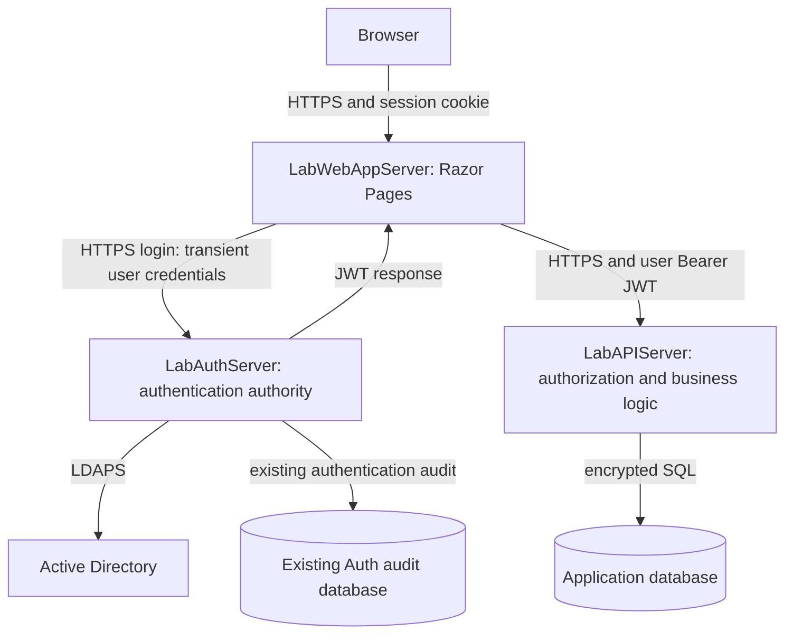

# Lab API + Web App: shared architecture and delivery plan

Date: 2026-09-21. Status: architecture approved at planning level; Phase 0 decisions remain open; Phases 1-10 NOT RUN. This is the single shared contract, decision list, and 11-phase roadmap for the [API plan](LabAPIServer-Development-Plan.md) and [Web App plan](../../../../../LabWebAppServer/Source/LabWebAppServer/docs/plans/LabWebAppServer-Development-Plan.md).

## 1. Scope and evidence

Follow [the solo developer playbook](../../../../../Solo-Developer-Project-Roadmap.md). Keep independent sibling operational roots at `C:\Apps\LabAuthServer`, `C:\Apps\LabAPIServer`, and `C:\Apps\LabWebAppServer`. The two new projects now use only `Source`, `Releases`, and `Scripts` as outer folders. Their existing three planning documents have been moved into the source repository locations and revised. No source code, schema, Git initialization, configuration, certificates, credentials, deployment, commits, tags, or releases are created in this review.

```text
C:\Apps\
  LabAuthServer\                        # existing project unchanged
  LabAPIServer\
    Source\LabAPIServer\                # future Git repository root
      docs\plans\                       # API and shared plans exist now
      src\, tests\, database\            # future implementation only
    Releases\                           # empty now
    Scripts\                            # empty now
  LabWebAppServer\
    Source\LabWebAppServer\             # future Git repository root
      docs\plans\                       # Web plan exists now
      src\, tests\                       # future implementation only
    Releases\                           # empty now
    Scripts\                            # empty now; no database folder
```

Initialize each Git repository only at `Source\<ProjectName>` during Phase 1. Do not initialize the operational root. Version script source inside that repository when implemented; outer `Scripts` holds deliberately deployed operational copies with recorded source/version. Future `Releases\<version>` holds the immutable ZIP, SHA256 and release record; extracted application files may use `Releases\<version>\app`. Keep recoverable previous versions there. Environment configuration/logs/protected recovery sets belong in restricted external operational storage, such as ProgramData or an approved backup destination, not additional outer `Backups`, `Deployments`, `Config` or database folders. No new operational files are created now. LabAuthServer has additional historical folders; leave all of them untouched rather than normalizing it.

The supplied architecture defines boundaries but does not specify a business domain, entities, screens, transactions, data sensitivity, or user volumes. An implementation agent must resolve decision D1 before inventing business endpoints, DTO fields, or tables. Foundation work can proceed after its own decisions are settled; a functioning business application cannot be declared complete from scaffolding.

Reference source: `C:\Apps\LabAuthServer\Source\LabAuthServer`, clean working tree at `1a8f373f2c2d7a0dddb08dd462ff9cd79023405c`. Its current runbook records deployed v1.0.0 from `784fa96b9436aee315fae2d7e669a2650dbff794`; source HEAD and deployed release are distinct. No live environment was probed for this plan. Environment-shaped source settings are evidence, not verified effective runtime configuration.

Read the reference's `Source/AGENTS.md` and repository `AGENTS.md`. Their nested-project starter location does not override the requested sibling roots. Two instruction links have moved: the coding standard and development plan are under `docs/internal/`; those actual files were inspected. Older documentation contains superseded deployment, HSTS, licensing, and release statements; use source for behavior and dated deployment/operations records for recorded environment evidence.

### Reference findings and reuse

| Area inspected | Evidence within the reference repository | Decision for these projects |
| --- | --- | --- |
| Boundaries | `docs/Architecture.md`, `src/*/*.csproj`, `Program.cs` | Reference has Domain/Application/Infrastructure/Api; start each new service with one executable project and responsibility folders. |
| Login and tokens | `Controllers/AuthController.cs`, Application DTOs and token services, `docs/JWT.md`, Infrastructure signing and certificate providers | Consume the actual direct login contract and public verification keys; no copied AD or signing implementation. |
| Authorization | `TokenConfigurationExtensions.cs`, `AdGroupRoleMappingService.cs` | Exactly one role; highest mapping wins; exact role policies, no implied hierarchy. |
| Configuration/security | `docs/Configuration.md`, `docs/Security.md`, token validators, ingress policies, source appsettings | Validate settings and transport budgets. Do not transplant deployment values, private-key providers, or broad host exceptions. |
| SQL/audit | `SqlAuditEventService.cs`, `docs/Testing.md`, `database/Phase11` references | Typed parameters, timeouts, explicit targets, correlation; business DB remains separate from Auth audit DB. |
| Dependencies/tests | csproj files, `global.json`, `docs/Testing.md`, `docs/Validation_Status.md` | Reference uses net10.0, xUnit/TestServer, SqlClient, LDAP and DPAPI. New projects need only their own subset. Isolate routine tests from infrastructure. |
| Release/deployment | `docs/plans/Phase-6/Release-Checklist.md`, `docs/Deployment.md`, `docs/Safe_Deployment_Procedure.md`, Phase 7 deployment record | One immutable artifact/checksum and one release record per app; test actual runtime identity and user route. |
| Operations/lessons | `docs/Project_Status.md`, `docs/operations/*`, Phase 9 maintenance plan | Health is liveness; reference audit is best effort; runtime file capture is disabled. File restoration is not proven service recovery. No approval packets or operations platform. |

Source evidence links: [JWT](../../../../../LabAuthServer/Source/LabAuthServer/docs/JWT.md), [architecture](../../../../../LabAuthServer/Source/LabAuthServer/docs/Architecture.md), [testing](../../../../../LabAuthServer/Source/LabAuthServer/docs/Testing.md), [release checklist](../../../../../LabAuthServer/Source/LabAuthServer/docs/plans/Phase-6/Release-Checklist.md), [deployment record](../../../../../LabAuthServer/Source/LabAuthServer/docs/plans/Phase-7/Phase-7-Deployment-Record.md), [operations](../../../../../LabAuthServer/Source/LabAuthServer/docs/operations/LabAuthServer-Operations-Runbook.md).

## 2. Architecture and dependency map



Authentication proves identity at Auth. API bearer middleware verifies that proof; it does not authenticate passwords or contact AD. API policies and business rules decide permissions, resource ownership, and state transitions. Web renders results and handles a local session; it does not issue identity tokens or authorize data access on the API's behalf.

No Web-to-SQL route, SQL package, database credential, directory service credential, LDAP client, or Auth signing private key belongs in Web. End-user credentials necessarily pass transiently through its login handler for the existing contract; never retain them in session, configuration, logs, or a password cache. API owns all application data and SQL scripts. Auth retains its separate SQL audit dependency. No fourth database application, shared source project, distributed message bus, Redis, or orchestration platform is required.

Keep CQRS, MediatR, generic repositories, event buses/message queues, Redis, Kubernetes, additional microservices, shared DTO assemblies, OAuth/OIDC infrastructure, distributed session storage, a separate database application, monitoring platforms and complicated CI/CD out of this implementation. Reconsider only for an actual demonstrated requirement. Use the existing direct Auth contract and simple manual/repeatable release process.

| Work | Can proceed with isolated fixtures | Real dependency required for acceptance |
| --- | --- | --- |
| API HTTP/error/policy foundation | Synthetic RSA tokens and fake repositories | Actual Auth-issued JWT/public key and agreed audience |
| API business rules/DTOs | Agreed D1 examples | SQL integration for persistence and transactions |
| Web layout/login/error/session handling | Stub Auth/API HTTP handlers | Auth and API for the real session journey |
| Database scripts | Agreed entities and disposable SQL | Actual deployment identity, encrypted target connection, backup |
| End-to-end/package smoke | Preparation can occur independently | Compatible Auth + API + Web + SQL + AD/trust |

These are parallel preparation opportunities, not a requirement for parallel agents or teams.

## 3. Actual Auth contract and proposed consuming flow

Existing endpoints: anonymous `GET /api/v1/health`; anonymous HTTPS `POST /api/v1/auth/login`; Reader-only `GET /api/v1/protected`. The latter is Auth's diagnostic resource, not a new business API route.

Login request JSON: `username`, `password`. Existing DTO limits are 1-1024 and 1-256 characters, with required validation; actual successful directory use requires the configured UPN rules. Entire UTF-8 JSON body must fit 8192 bytes, including escaping. Do not trim/normalize the password. Success JSON: `accessToken`, `tokenType` (`Bearer`), `expiresAt` (UTC DateTimeOffset). There is no `expiresIn`, refresh token, user-info, logout, JWKS, discovery, token exchange, or introspection endpoint in the inspected surface.

Failures include 400 invalid input, 401 credentials rejected, 413 body limit, 429 shared login throttling, 503 directory/unavailable/capacity, 504 decision timeout, 499 caller cancellation, and safe 500 failures. A valid directory user with no approved mapped role currently cannot receive a token and can get 500. Web must not reinterpret that as a successful no-role session. Auth limits all login callers collectively to ten requests/minute with no queue; capacity suitability needs D6. No automatic password retries.

1. Browser opens Web over HTTPS. Anonymous protected-page navigation leads to `/Account/Login` with a validated local return URL.
2. Web renders a login form with antiforgery protection. On POST, validate form and encoded downstream body size; credentials remain request-local.
3. Web sends the exact JSON contract to the configured, fixed HTTPS Auth base URL. Disable redirects on this client so credentials cannot be forwarded to another destination. Never derive the destination from browser input.
4. Auth uses its existing service-account search, submitted-user bind, and direct group lookup. Highest mapped role wins: Administrator, then Operator, then Reader. No nested membership expansion is promised.
5. Auth signs the JWT and attempts its existing authentication audit. Web handles failures safely, discards credential references, and establishes no session on failure.
6. Web checks the Auth response's bounded JSON shape and `tokenType=Bearer`, holds the token only in request-local server memory, and calls the fixed API `GET /api/v1/session` with it. API validates the complete JWT contract and returns `{subject, role, expiresAt}` from the validated principal and signed `exp`. Web does not decode or cryptographically validate JWTs, configure JWT trust, or load Auth public keys. API validation failure, outage, malformed session response or elapsed expiry prevents session creation; discard the pending token. No fallback to Auth response fields or unsigned token decoding.
7. Only after a successful API session response, Web creates a fresh random server session handle from that verified identity/role and API-provided expiry. Keep the JWT and authentication ticket only in a bounded in-process ticket store; cookie contains a protected handle, not the token. Never accept a browser-supplied token as login input. The API session endpoint has no SQL dependency and grants no business permissions beyond its verified identity response.
8. Web checks session/expiry on each protected request, then sends a per-request Bearer header to the fixed API destination. Do not put one user's header on a shared HttpClient's default headers.
9. API validates JWT independently, evaluates endpoint policy, and checks relevant resource permissions/business conditions from application data.
10. API calls approved stored procedures with typed parameters under its own runtime identity, maps returned rows/results to DTOs, and returns them. SQL Server owns application CRUD statements and constraints; Web HTML-encodes and renders the DTOs.
11. API 401 removes the local session and requests login; 403 renders access denied without retrying login. SQL/upstream failures show a safe retry/error page, not a login loop.
12. Antiforgery-protected POST logout removes the server ticket and clears the cookie. Expiration does the same. No Auth logout call exists. An already stolen JWT remains usable until its accepted expiry; immediate global revocation is not supplied by this architecture.

## 4. JWT trust contract

The validation rules below belong to LabAPIServer. Web treats the JWT as opaque and trusts the verified session DTO only over its configured, normally validated HTTPS connection to that API. Cookie/Data Protection security remains Web's separate responsibility.

| Item | Inspected baseline | API validation rule |
| --- | --- | --- |
| Issuer | Source `Token:Issuer` is `https://DC01.lab.local` | Pin exact effective issuer per environment; do not infer issuer from login URL or token. Confirm with Auth owner before integration. |
| Audience | Source `Token:Audience` is `LabAuthServer.API` | D2 is mandatory: this is not automatically an audience grant to LabAPIServer. No disabled audience validation or wildcard acceptance. |
| Algorithm | Source RS256; implementation also supports other RSA algorithms | Pin RS256 for baseline; algorithm changes require a contract revision. Reject none, HMAC, and token-selected alternatives. |
| Key | Auth certificate private key signs; `kid` identifies approved key | API receives only the public certificate/key with independently verified fingerprint and explicit `kid` map. Web receives no JWT verification keys. Neither new app receives PFX, private signing key, private-key ACL, or Auth DPAPI provider. |
| Lifetime | Source one hour; configurable | Require signed `exp`, `nbf`, `iat`; numeric dates and consistent ordering. Enforce lifetime and the agreed maximum (baseline 3600 seconds). |
| Clock skew | Source five minutes | API baseline 300 seconds; test boundaries. Session endpoint additionally requires `exp` still in the future and returns it as `expiresAt`; Web stops at that expiry with no extra skew. Confirm time synchronization. |
| Required claims | `iss`, `aud`, `sub`, `jti`, `iat`, `nbf`, `exp`, exactly one `role`; `scope` array currently empty | Validate required scalar/cardinality rules, nonempty subject/JTI and numeric dates; reject missing/duplicate identity/role claims. Do not require nonexistent OAuth `client_id` or scopes. |
| Mapping | `sub` name, `role` role; inbound mapping disabled | Preserve exact names and case. Allow only Reader, Operator, Administrator. No inferred inheritance. |
| Identity meaning | `sub` is submitted username, not an immutable AD object ID | Trust it only as Auth's asserted identity. Do not assume it is stable after rename or safe as a permanent business FK; settle D3 if per-user ownership is needed. |
| Transport | Encoded JWT <=12288 bytes; Authorization value <=12352 bytes | Adopt compatible bounded ingress and client response limits; never truncate. Verify actual IIS/proxy route before release. |

Reject invalid/malformed/expired/wrong-signature/wrong-issuer/wrong-audience/unknown-key tokens with 401 and `WWW-Authenticate: Bearer`; no login redirect from API. Authenticated callers lacking a business policy receive 403. Oversize headers may produce 431 before authentication; native IIS errors can precede application middleware. Never log the rejected token or trust its subject for audit.

API trusts signed identity/role assertions only after complete verification on every protected request, including `/api/v1/session`. It independently enforces audience, issuer, lifetime, key/algorithm, claim structure, input validity, resource ownership, record state, and policy. Web validates the session DTO shape and future UTC expiry, not the JWT claims. A signature does not prove a user still has current AD membership or that a requested record belongs to them. UI visibility is never API authorization.

There is no discovered metadata endpoint to place in `Authority`. Configure bearer validation explicitly. Public certificates remain controlled external trust configuration: verify source/fingerprint out of band, pin to `kid`, reject ambiguous/unapproved keys. Retain the reference's RSA 2048-4096-bit, certificate validity and compatible signing-usage checks for certificate imports. Do not follow token `jku`/`x5u` URLs.

Rotation: distribute next public key to API first; verify configuration; arrange Auth signing cutover separately; retain old public key until the last old token lifetime plus skew has elapsed, bounded by the agreed previous-key expiry and certificate validity. Test active/previous/unknown/retired keys and active-key survival after previous expiry. Web needs no JWT key update; verify its login/session call through API after rotation. Record key/configuration revision with releases. Compromise requires coordinated removal and forced re-login; no routine key changes occur in this task.

## 5. Decisions and assumptions

Approved planning decisions: the three application boundaries, one API project, Razor Pages Web, single-process server-side sessions, API-only JWT validation through `/api/v1/session`, and the outer Source/Releases/Scripts layout. Reference-supported facts: direct JSON login, one role, no refresh/revocation, and isolated tests/immutable releases. Approval of architecture does not resolve the unknown business scope or effective Auth audience.

Current decisions and blockers are recorded once in [Phase 0 — Architecture & Decisions](Phase-0/Phase-0-Architecture-and-Decisions.md). Before Phase 1, resolve the first real feature/entities/data/business endpoints (D1), business action/role matrix (D3), audience choice (D2), and deployment target (D6 host decision). Development URLs (D8) retain the instructed defaults after the local conflict check; actual test Auth provisioning is a Phase 3 prerequisite. A dedicated audience requiring Auth changes is a separately scoped dependency, not permission to modify Auth here. Later operational questions do not become additional Phase 1 approval gates.

| ID | Unresolved decision / stage blocked | Recommended default and consequence |
| --- | --- | --- |
| D1 | Before Phase 1: first real workflow, entities/fields, screens, actual API routes/DTO examples, read/write actions and data sensitivity | One small read-oriented vertical slice of real agreed data, followed by only necessary writes. Record example requests/results, validation and success/denial. No invented lab orders/patients/results. |
| D2 | Before Phase 1: audience decision; before Phase 3: effective issuer and public trust handoff | For the smallest lab integration, explicitly designate the existing audience as shared by these two API resources only if the owner accepts token reuse across both. Otherwise use a dedicated LabAPIServer audience via a separately scoped Auth change that preserves existing clients. Current single-audience issuance cannot silently provide per-client audiences. Never change Auth as part of this plan. |
| D3 | Before Phase 1: action-to-role matrix; resolve ownership/identity policy if required by D1 | Explicit allowlists per action, no implicit Administrator bypass. For the first agreed read action propose Reader only, but owner must confirm whether Operator/Administrator should also read. If ownership is required, resolve stable subject mapping/rename policy before schema design. |
| D4 | Before Phase 5: confirm detailed idle/capacity settings and acceptance of logout/stale-role limits; not an extra Phase 1 gate | Approved baseline is Razor Pages, one worker, in-memory server tickets and re-login after recycle. No refresh/global revocation exists. If continuity, multiple workers or immediate revocation becomes a real requirement, scope it separately; no distributed storage in this plan. |
| D5 | Phase 2: database name/isolated target; Phase 4: required audit/identity schema; before Phase 9: recovery/retention | Separate `LabApplication` DB, `app` schema; transactional audit for required business writes, diagnostics best effort. For low-value lab data propose daily full backup, seven daily copies, encrypted off-host copy, RPO 24h/RTO one working day; confirm data value before adopting. These are not additional Phase 1 gates. |
| D6 | Before Phase 1: deployment host/topology; later: DNS, capacity, identities, trust and test accounts for Phases 3/7/9 | Existing approved Windows/IIS capacity with separate applications/pools/identities, one worker per app; dedicated nonprivileged allowed/denied test users. Do not assume the Auth domain controller or reuse its identity. Check shared ten-login/minute capacity before real acceptance. |
| D7 | Phase 1 implementation choice: SDK/packages; Phase 2 prerequisite: isolated SQL target | net10.0 to match reference, pin a supported installed SDK and compatible serviced dependencies during foundation. Reference pins 10.0.400/latestPatch; no current patch claim. Existing dev SQL/LocalDB; no containers required. No separate architectural approval for routine version selection. |
| D8 | Defaults recorded in Phase 0; provisioning/trust required before real Phase 3 integration | Auth https://localhost:7068, API https://localhost:7168, Web https://localhost:7268. No active TCP listeners found on these ports at the Phase 0 check; recheck when starting. No services started. Use separately configured nonproduction Auth or an authorized test service later; never assume live production credentials. |

Assumptions to confirm: internal browser app; modest single-instance load; no MFA/SSO/offline/federation requirement; no regulatory audit mandate stated; no preexisting business schema. If any assumption changes, revisit only the affected decision. Resolve required answers with the owner during implementation kickoff; planning does not need fabricated answers.

## 6. Local workflow

Proposed local URLs: Auth `https://localhost:7068` (existing HTTPS profile), API `https://localhost:7168`, Web `https://localhost:7268`. Check collisions before assigning. Use trusted development HTTPS certificates later; no HTTP credential submission or certificate-validation bypass. Local Auth needs an explicit development-only AllowedHosts override because its source host allowlist excludes localhost. Login destination and JWT issuer are separate settings.

Use a separately configured development Auth instance or an explicitly authorized test Auth service. Do not copy live credentials, certificates, DB settings, or audit data. A local instance still requires nonproduction directory/service credential/signing/public-key and Auth-audit configuration through its existing mechanisms; no source modifications are necessary. If those prerequisites are absent, use stubs for isolated development and mark real integration NOT RUN.

Startup order: prepare developer SQL and apply reviewed application migrations; start/configure test Auth and its own dependencies; start API; start Web. All three application processes can be prepared independently, but login/data smoke needs the full chain. Use actual authorized enabled AD accounts with direct mapped roles; the reference runbook records no standing Reader account, so do not assume one exists or reuse its membership-changing helper.

Future developer commands after scaffolding (not runnable from today's plan-only roots):

```powershell
# Terminal 1: reference source, with separate development configuration
dotnet run --project src/LabAuthServer.Api --launch-profile https
# Terminal 2: C:\Apps\LabAPIServer\Source\LabAPIServer
dotnet run --project src/LabAPIServer.Api --launch-profile https
# Terminal 3: C:\Apps\LabWebAppServer\Source\LabWebAppServer
dotnet run --project src/LabWebAppServer.Web --launch-profile https
```

Each new repository will document `dotnet restore <solution>.slnx`, `dotnet build <solution>.slnx -c Release --no-restore`, and `dotnet test <solution>.slnx -c Release --no-build --filter "Category!=SqlInfrastructure&Category!=SystemAcceptance"`. Default unfiltered tests must also be safe: infrastructure is disabled without explicit opt-in AND an explicit disposable/authorized target. Missing mandatory evidence is NOT RUN, not PASS. No production fallback.

## 7. Eleven-phase roadmap

This is the single execution roadmap referenced by both project plans. Current status: architecture review and plan relocation complete; Phase 0 decision closure remains pending; Phases 1-10 are NOT RUN. The work described below is future work, not authorization to implement or deploy in this task.

For every phase, the common Definition of Done requires its acceptance criteria and required tests to pass, a safe diff review, and one updated status/next action with evidence and limitations. Files existing is not completion. Record PASS, FAIL, NOT RUN and NOT APPLICABLE accurately. A required test lacking a target/account remains NOT RUN and blocks that phase; tests intentionally assigned to later phases do not block earlier work.

### API Endpoint Change Rule

The [API Endpoint Change Rule](../../../../../Solo-Developer-Project-Roadmap.md#api-endpoint-change-rule) is mandatory for every new, modified, or removed API endpoint and forms part of the common Definition of Done. Update the correct Postman collection/folder with the method, path, headers, authentication, applicable body examples, and response assertions. Cover success, authentication, authorization, validation/errors, and fixture cleanup, including the expected behavior for Reader, Operator, and Administrator on role-based endpoints.

Do not mark the feature complete until source implementation exists, the deployment artifact contains it, the Postman collection contains the endpoint, required Postman tests pass, and authorization behavior is verified. For removed endpoints, record and test the removal contract. Required tests that were not executed remain NOT RUN; source or package presence alone is insufficient.

### Phase 0 — Architecture & Decisions

- **Objective:** define the smallest real feature within the approved architecture.
- **Prerequisites:** these plans, shared playbook and actual Auth contract.
- **Implementation work:** documentation only; resolve first feature, entities/data, actual API endpoints, role/action matrix, Auth audience, development URLs and deployment target. Record D1/D2/D3/D8 and the D6 host decision; do not invent business requirements or prematurely demand operational details.
- **Tests:** trace allowed/denied login-to-data journeys; check audience, session, SQL and host boundaries against the reference.
- **Deliverables:** one [Phase 0 decision record](Phase-0/Phase-0-Architecture-and-Decisions.md); first-slice request/response/acceptance examples remain owner-required until the feature is supplied.
- **Acceptance criteria:** the first implementation increment has a defined domain, contracts and environment direction; costly unknowns above are answered.
- **Definition of Done:** decisions recorded and consistent across plans, plus common DoD; architectural approval alone does not close Phase 0.
- **NOT RUN:** outstanding owner decisions; all builds/runtime/infrastructure tests belong to later phases.

### Phase 1 — Project Foundations

- **Objective:** both repositories build with the smallest solution/test structures.
- **Prerequisites:** Phase 0 decisions closed; supported local SDK selected during this phase.
- **Implementation work:** initialize Git at each Source/project root; add solution, one app project, one test project, README, AGENTS.md, safe configuration baseline, .gitignore and documented build/test/run commands. API uses controller hosting; Web uses a minimal Razor Pages host. Keep business code, login implementation and SQL integration for later phases.
- **Tests:** restore/build both solutions, safe host/configuration tests and startup from documented commands; prove default tests cannot contact infrastructure.
- **Deliverables:** two buildable skeletons and minimal developer instructions; no extra applications/assemblies.
- **Acceptance criteria:** fresh-checkout commands work for both projects, default tests pass without AD/SQL/operational secrets, and artifacts/local secrets are ignored.
- **Definition of Done:** both builds and meaningful foundation checks pass, plus common DoD.
- **NOT RUN:** real SQL, JWT integration, login/browser business journey, release and deployment, intentionally assigned later.

### Phase 2 — Database + API Foundation

- **Objective:** establish safe API hosting and application SQL/migration boundaries without a business feature.
- **Prerequisites:** Phase 1; explicit isolated SQL target, database identity/name and migration approach from D5/D7.
- **Implementation work:** API health, validated configuration, encrypted SQL connection adapter, ordered migration mechanism/ledger, disposable DB setup, safe errors and basic logging. No invented business tables, sample resources or production provisioning.
- **Tests:** health independent of SQL, configuration rejection, explicit-target safeguards, encrypted connectivity, migration ordering/checksum/locking/failure and least-privilege boundaries against isolated SQL.
- **Deliverables:** functioning API foundation, database tooling within the API repository and documented test setup.
- **Acceptance criteria:** SQL works only against an explicitly selected target; runtime cannot apply DDL; migration errors stop safely; liveness is not represented as readiness.
- **Definition of Done:** foundation and opt-in database tests pass with actual evidence, plus common DoD.
- **NOT RUN:** business CRUD/schema slice, actual Auth integration, Web journey and production operations.

### Phase 3 — Auth/JWT Integration

- **Objective:** API verifies the actual Auth-issued token contract and exposes verified session identity.
- **Prerequisites:** Phase 2; settled D2 audience, effective issuer/algorithm/public key handoff and authorized Auth test service/account.
- **Implementation work:** API issuer/audience/algorithm/signature/lifetime/required-claim validation, public-only key trust, role policies, 401/403 handling and `GET /api/v1/session` returning verified subject/role/expiry. No AD/password logic, Auth changes or Web JWT verifier.
- **Tests:** synthetic valid/invalid/expired/wrong-claim tokens, key rotation/skew/size boundaries; policy-handler allowed/denied cases; session DTO/no-SQL behavior; real Auth-issued token acceptance. Use test-host-only authorization fixtures if needed for 403, not placeholder production business routes.
- **Deliverables:** API JWT integration, session contract and tests tied to the selected Auth version/configuration profile.
- **Acceptance criteria:** session requires complete token validation; failure leaks no identity; expiry is derived from signed exp; keys are public-only; API validates every protected request.
- **Definition of Done:** deterministic and required real Auth acceptance checks pass, plus common DoD. Missing test credentials remain NOT RUN, not proof of integration.
- **NOT RUN:** first business endpoint, Web login UI and full browser-to-SQL flow.

### Phase 4 — First API Business Feature

- **Objective:** implement exactly one agreed real vertical slice: HTTP -> authorization -> service -> SQL -> response.
- **Prerequisites:** Phases 2-3 and D1/D3; required audit semantics agreed before the affected action is implemented.
- **Implementation work:** actual DTOs/validation, action and resource policies, business service, required schema migration/query/transaction, response and audit. No placeholder resources or speculative features.
- **Tests:** first-slice success and invalid-input cases, actual allowed/denied roles, resource ownership if applicable, disposable SQL persistence/constraints/failure and required audit atomicity.
- **Deliverables:** one useful API business slice, migration and accurate contract examples.
- **Acceptance criteria:** the agreed data/result is returned only to permitted users and failures obey the stated contract.
- **Definition of Done:** required business/HTTP/SQL checks pass and contract matches behavior, plus common DoD.
- **NOT RUN:** full browser feature, production deployment and operational recovery.

### Phase 5 — Web App Foundation

- **Objective:** turn the Phase 1 Razor Pages skeleton into a secure login/session/UI shell.
- **Prerequisites:** Phase 1 and Phase 3 session DTO contract; can be prepared independently of Phase 4 using controlled HTTP responses.
- **Implementation work:** layout, configuration, login/logout/access denied/error pages, Auth/API HTTP clients and bounded server-side ticket storage. Login forwards Auth token to API session verification before creating a cookie. No SQL, JWT parsing/verification, public JWT keys or business-rule duplication in Web.
- **Tests:** controlled-client login success/failure, session rejection/API outage, antiforgery, cookie flags/token absence, handle rotation, logout/idle/absolute expiry, cross-user isolation and safe errors.
- **Deliverables:** usable Web foundation with typed client contracts and session behavior.
- **Acceptance criteria:** API-verified session DTO is the sole login identity source; invalid or unavailable verification cannot create a session; only an opaque cookie handle reaches the browser.
- **Definition of Done:** Web foundation and browser-security checks pass against controlled dependencies, plus common DoD.
- **NOT RUN:** actual browser-to-business-SQL acceptance is Phase 6; isolated stubs do not establish real integration.

### Phase 6 — Web + Auth + API Integration

- **Objective:** prove the first real business feature through the browser.
- **Prerequisites:** Phases 4-5 and authorized test Auth/AD, API and application SQL with normal HTTPS trust.
- **Implementation work:** connect the business page to the actual API DTO, wire real Auth -> token -> API session verification -> Web session, then authorized SQL data -> API -> Web -> browser.
- **Tests:** actual allowed-user login, session verification, data display, safe denied action and logout; inspect exact required audit correlations.
- **Deliverables:** working first browser feature and concise real-chain evidence.
- **Acceptance criteria:** the displayed result comes from the agreed SQL fixture through API authorization; no fake service or direct SQL substitutes for acceptance.
- **Definition of Done:** real journey passes with target/account identity recorded safely, plus common DoD.
- **NOT RUN:** full negative-path qualification, immutable package validation and production cutover remain Phases 7-9.

### Phase 7 — End-to-End Validation

- **Objective:** verify the implemented system's successful and failed user journeys.
- **Prerequisites:** Phase 6; controlled fault-test targets/accounts and required audit expectations.
- **Implementation work:** close observed defects without expanding feature scope; run section 8 matrix against the actual feature and contract.
- **Tests:** anonymous access; successful/failed login; allowed/denied role; invalid/expired JWT; API unavailable; Auth unavailable; logout; idle/absolute session expiration; database failure; required audit behavior. Fault injection uses isolated infrastructure, never damaged production settings.
- **Deliverables:** one sanitized validation record with results, source revisions and meaningful exclusions.
- **Acceptance criteria:** required cases execute and pass; unavailable dependencies never produce an authenticated fallback or fabricated business success.
- **Definition of Done:** no unresolved required failure/skip, plus common DoD; optional follow-ups remain clearly optional.
- **NOT RUN:** exact release ZIP qualification and actual target deployment; these require Phases 8-9.

### Phase 8 — Release Packaging

- **Objective:** qualify one identifiable immutable package per application.
- **Prerequisites:** Phase 7 evidence, selected exact source commits and supported compatibility row.
- **Implementation work:** source commit -> restore -> build -> tests -> publish -> immutable ZIP -> SHA256 -> release record under each outer Releases/version. API includes its migrations; Web includes no database content. Exclude environment settings/secrets; record version/source/config/schema compatibility. Never build on the deployment server.
- **Tests:** Release builds/suites, archive inspection/checksum, extraction and real package smoke using the exact bytes; resolve any later release tag to recorded source before publication.
- **Deliverables:** API and Web ZIPs/checksums/release records and tested combined compatibility row.
- **Acceptance criteria:** source-to-package traceability and actual package behavior are proven; packages are frozen after qualification.
- **Definition of Done:** both exact artifacts pass required checks, plus common DoD; changed bytes require a new candidate identity/checksum.
- **NOT RUN:** production activation/smoke; tag/publication remains NOT RUN if not separately in scope and is not inferred from ZIP creation.

### Phase 9 — Deployment

- **Objective:** activate compatible releases on the chosen target with a usable recovery path.
- **Prerequisites:** Phase 8 packages, target/identity/trust/configuration inventory, backup/recovery objectives and verified prior recovery set.
- **Implementation work:** database -> verify compatible existing Auth -> API -> Web -> end-to-end smoke. Use separate IIS applications/pools/identities, preserve previous releases/settings, stage exact packages and switch only intended apps. Do not assume the Auth domain controller is the target or redeploy unchanged Auth.
- **Tests:** artifact parity, actual identity permissions, trusted remote route, anonymous/allowed/denied behavior, real login/data/audit/logout smoke and rollback prerequisite checks.
- **Deliverables:** actual deployed paths/version/hash/settings revision, smoke result and recovery instructions.
- **Acceptance criteria:** required target smoke passes; on failure recover the prior state and leave deployment incomplete until corrected. No target rebuild or incidental Auth/AD/global IIS changes.
- **Definition of Done:** successful activation/evidence and recovery readiness, plus common DoD; schema rollback does not erase subsequent data/audit.
- **NOT RUN:** full service rollback/off-host recovery unless deliberately exercised; backup presence is not a recovery test. Phase 10 records remaining limits.

### Phase 10 — Operations

- **Objective:** make normal operation and recovery practical for one developer.
- **Prerequisites:** successful Phase 9 deployment and known active paths, settings, logs and backup set.
- **Implementation work:** short runbook/recovery checklist per app; health/scoped restart, backup and rollback verification, maintenance cadence; read-only checker only if useful. No monitoring platform or automatic repairs.
- **Tests:** verify documented health/config/log locations, backup hashes and isolated SQL/file restore; check rollback artifact/config/schema compatibility and exercise scoped recovery in a representative safe environment. Test checker PASS/WARN/FAIL only if built.
- **Deliverables:** accurate runbooks, recovery checklist and verification results/limits.
- **Acceptance criteria:** actual operator steps and recovery resources are usable; state precisely which of file restoration, service rollback and host-loss recovery has been proved.
- **Definition of Done:** required recovery checks for the chosen RPO/RTO pass, plus common DoD. A required unperformed recovery test blocks completion; optional production rehearsal can remain disclosed.
- **NOT RUN:** production rollback and off-host recovery when not exercised; optional checker execution if no checker is justified. Do not relabel these as PASS.

## 8. End-to-end acceptance and smoke

Run the matrix in Phase 7 against the implemented system, repeat affected exact-package checks in Phase 8, then deployment smoke through the intended remote browser route under real application identities in Phase 9. Before Phase 6, replace `the business read route` below with the actual Phase 4 route and real response expectations. No generic `/protected`, Operator-success route, write feature, audit field, or refresh endpoint is assumed in the new apps.

| Scenario | Expected evidence |
| --- | --- |
| HTTPS / startup | Trusted hostname/chain; Web page and both liveness endpoints respond; no bypass switches |
| Anonymous access | Protected Web page challenges login; direct business API request is 401, with no data/query execution |
| Login failure and success | Invalid credentials give safe message; enabled allowed-role account receives Auth JWT and server-held Web session; no token/password in browser storage or output |
| API session verification | Auth token is forwarded server-side to `/api/v1/session`; only its verified subject/role/expiry creates the local session. No JWT parsing/public keys in Web; malformed/failed verification creates no ticket |
| Auth unavailable | Safe login failure, no new session and no password retry; an existing unexpired session may continue API access without contacting Auth |
| API unavailable | Login cannot complete session verification; existing sessions show safe temporary data errors without fabricating success or unnecessary credential retries |
| Real business read | Web forwards token, API verifies and authorizes, SQL returns known test fixture, Web displays expected fields under actual identities |
| Role denial | Separately authenticated wrong-role account receives 403 on the same implemented business action; no assumption that Administrator includes Reader |
| Invalid/expired token | Tampered token and legitimately expired token rejected by API; Web clears session on 401. Use synthetic token fixtures only in isolated tests, never inject test signing trust in production |
| SQL / errors | Required transaction/query and persisted audit match fixture/correlation; induced outage/rollback tests occur in disposable environment, not by damaging production |
| Audit | Auth login event and agreed API event correlated to exact requests; authorized inspector reads evidence. Auth denial may omit role; do not demand it |
| Logout / expiry | POST logout removes ticket; replayed cookie cannot call API through Web; absolute/idle expiry and recycle force login; no claim of JWT revocation |
| Security boundaries | Antiforgery rejection, safe local return URL, no cross-user token leakage, required invalid-input behavior, no secret/body logging |

Production expiry checks can wait for an ephemeral token to expire; never alter server clocks, Auth lifetimes, AD memberships, or keys just to manufacture smoke evidence. Package/tests cover fault injection; deployment smoke confirms the real successful journey and safe denials. Capture statuses, sanitized fixture outcome, correlation, version/hash, and UTC time, never raw credentials/tokens/data dumps.

## 9. Release, contracts, and compatibility

Each repository follows `source commit -> restore/build -> tests -> immutable package -> SHA256 -> package smoke -> deployment -> target smoke`. Pin SDK/dependencies and retain one release checklist per version. Exclude local/production settings, secrets, public trust deployment files, private keys, logs, and test output from application ZIPs; safe configuration examples can be separately documented. Database migration files are part of the API release with their checksums, not an independent server release.

Use independent semantic application versions. Auth contract baseline is its existing `/api/v1` plus the JWT profile in section 4; record a documentation profile revision, not an invented JWT claim. New API routes use `/api/v1/...`; preserve existing request/response fields and error semantics within v1. Add optional response fields compatibly; clients ignore unknown fields. Required fields, changed meanings, narrowed role access, subject format, changed issuer/audience or signing requirements need explicit compatibility review. Use `/api/v2` only for an actual breaking business contract and keep v1 until the deployed Web has migrated. No versioning service or shared binary DTO package is needed.

The combined release record must contain one tested row: Auth version/source + effective JWT profile/key-set revision; API version/source/hash + supported JWT profile + API contract revision + minimum/maximum compatible schema migration; Web version/source/hash + supported API contract + session/config revision. Values remain unfilled until built and tested; do not invent version compatibility from names alone.

Before deployment, run contract tests from real serialized fixtures through the consumers, negative JWT tests, schema upgrade tests, and the real chain using the selected Auth version and exact API/Web packages. Compare public DTO/OpenAPI changes and settings against the last supported row. Test previous Web with new API for additive rollout; test previous API against expanded schema for rollback. A breaking pair requires a coordinated outage or overlap plan before cutover. A passing unit test alone does not prove release compatibility.

Tag only the recorded built commit and verify the resolved SHA before later publication. Verify handed-off/downloaded checksums. Never rebuild on production, overwrite published assets, or move a published tag. No release/tag/publication is performed now.

## 10. Deployment and recovery

Recommended target: approved Windows x64/IIS with compatible ASP.NET Core Hosting Bundle/ANCM, separate sites and app pools, No Managed Code, one worker for Web's in-memory sessions. Confirm OS/runtime support at implementation/deployment time. Do not infer that the reference domain controller is the correct host for these apps.

Proposed operational locations, to confirm in target inventory: `<DEPLOY_ROOT>\LabAPIServer\Releases\<version>\app` and corresponding Web path, with ZIP/checksum/release record beside app under that version. Source repository roots are `C:\Apps\LabAPIServer\Source\LabAPIServer` and `C:\Apps\LabWebAppServer\Source\LabWebAppServer`. Configuration lives under restricted `C:\ProgramData\<App>\Config`; Web Data Protection keys under its own restricted Keys directory; logs and protected recovery sets under external operational storage, not extra outer folders. Previous immutable releases remain under Releases. Current IIS physical path, not a directory named Current, identifies the active version. No separate root Backups/Deployments is created.

Separate API and Web IIS applications/pools/runtime identities from deployment/migration identity and Auth identity. Both runtime identities read their own binaries/config; only API reads JWT public trust. Web may write its own Data Protection keys/logs; API gets limited application DB permissions. Web gets no SQL login, AD service secret or JWT key. Auth retains all existing identity/key rights. Public-key trust installation never grants access to Auth's private key.

Plan DNS `<API_HOST>` and `<WEB_HOST>` with trusted HTTPS certificates for each name; Auth URL remains separately configured. Browser reaches Web TCP 443; Web reaches Auth/API 443; API reaches only the configured SQL endpoint/port; Auth retains its existing AD/SQL network paths. DNS/time/certificate-chain dependencies also need normal connectivity. SQL TCP 1433 is only a default for a fixed-port instance, not an assumed target rule. Limit API exposure to intended callers/administration paths; CORS is unnecessary for server-to-server Web calls. No SQL firewall route from Web.

Deployment order:

1. **Database:** verified backup, apply reviewed expand-compatible migration with migration identity, verify checksum ledger and runtime grants.
2. **LabAuthServer:** confirm existing compatible release/configuration/trust and health/login. Reuse the working deployment; no redeploy required unless a separately authorized Auth change resolves D2.
3. **LabAPIServer:** stage exact package, external settings/public trust, verify runtime identity and SQL; switch only its pool/site and smoke.
4. **LabWebAppServer:** stage exact compatible package/settings, set restricted Data Protection storage, switch only its site/pool. Expect sessions to be lost on restart.
5. **End-to-end smoke:** trusted remote browser, login, real API data, denials, audit, logout; record combined compatibility row and actual active paths.

Packages, DNS/certificate requests, permission plans, fixture preparation, and backup checks can be prepared independently. Activation still follows dependencies. Configure HTTPS-aware hosting only for known IIS/proxy hops; do not trust arbitrary forwarded headers. Confirm host allowlists, transport limits, certificate usability and outbound trust under service identities. Avoid machine-wide `iisreset` or global IIS changes.

Rollback triggers: failed startup/trust/login, unintended authorization/data exposure, incompatible DTO/schema, missing required audit, or failed core smoke. Preserve diagnostics; stop only affected new app; switch back to captured previous package and matching external configuration/public trust; restart and rerun relevant smoke. Roll back Web first when isolating an incompatible Web/API pair. Keep expand-only schema changes compatible with the previous API; do not automatically run down migrations or restore the DB for a binary rollback. Destructive schema change needs a distinct outage/restore or forward-fix plan accounting for writes since backup. Never erase business/auth audit as routine rollback.

First installation rollback means disable the new sites/pools and return to their prior absence while retaining database/evidence for review; do not disturb Auth. SQL backup/restore uses an isolated restored database first, integrity checks and actual application reads; file checksum verification alone does not prove recoverability. Choose RPO/RTO before valuable data enters production. Preserve encrypted off-host backups where host-loss recovery is required. Data Protection recovery is separate from Auth signing-key recovery; loss of volatile Web sessions deliberately causes re-login. Record recovery READY versus TESTED and untested host-loss cases honestly.

## 11. Operations baseline

Each app gets only a short runbook and recovery checklist when deployment is real. Record health URL/limits, actual active path/version/hash, configuration location/precedence/restart needs, scoped pool restart, real log/audit locations, backup/restore, rollback, and next action. API health proves liveness, not SQL. Web health proves liveness, not Auth/API. Auth keeps its existing runbook and best-effort audit; do not rewrite it.

Recommended new-app durable diagnostic sink: bounded Windows Event Log for warnings/errors plus normal IIS access logs; provision any event source at deployment, not with runtime admin rights. Verify actual capture and retention before claiming diagnostics exist. Console output is useful locally but is not presumed captured by IIS. API business audit stays in application SQL where required; Web session diagnostics remain logs, with no new audit database.

Weekly/manual checks: trusted health and active version/path, failed requests, backup completion. Monthly: HTTPS/JWT/SQL certificate expiry, runtime/package support and patches, least-privilege access, backup readability and retention. Restore a selected backup into isolation on the agreed cadence (propose monthly for valuable state) and after recovery changes. A checker, if useful, is read-only PASS/WARN/FAIL with explicit limits; it must not rebuild, repair, restart, renew keys, or change permissions.

## 12. Planning validation and completion boundary

Review checklist: sibling roots; Auth owns credentials/signing; API owns business SQL; Web has no SQL/AD dependency; public-only JWT trust; explicit audience decision; real contracts; compatible deployment order; isolated tests; immutable artifacts; data-aware rollback; no fourth application. Local links, Markdown fences, whitespace, new file inventory, and reference Git status are checked at completion. Builds, application tests, live login/SQL, deployment and recovery are NOT RUN because this task creates plans only.

Review changes (2026-09-21): moved all three existing plans under Source/project/docs/plans and corrected cross-links/command roots; restricted outer folders to Source/Releases/Scripts; removed Web JWT verification/key configuration; made API session verification mandatory and added API-verified expiry; replaced the old nine-phase sequence with the requested Phases 0-10; separated Phase 1 skeletons from later SQL/business/Web integration; clarified release/recovery locations and pre-Phase-1 decisions. Existing architecture boundaries, public-only API trust, isolated testing, immutable release and data-aware rollback remain intact.

The prior plan-review validation covered local links, balanced fences, whitespace, the original three Markdown plans, three allowed outer directories per project, no Web database directory, and all eight required fields in each of the 11 phases. The additional Phase 0 record now holds current decisions and its own validation limits. Phase references and the Auth -> opaque JWT -> API session -> Web session flow remain consistent. LabAuthServer is unchanged. Builds, application/browser tests, live login/SQL, packaging, deployment and recovery are NOT RUN. Remaining Phase 0 decisions mean PLAN READY is not PHASE 1 IMPLEMENTATION STARTED or DEPLOYMENT READY.

Framework references consulted for the proposed mechanics: [Razor Pages](https://learn.microsoft.com/en-us/aspnet/core/razor-pages/?view=aspnetcore-10.0), [cookie authentication](https://learn.microsoft.com/en-us/aspnet/core/security/authentication/cookie?view=aspnetcore-10.0), and [ITicketStore](https://learn.microsoft.com/en-us/dotnet/api/microsoft.aspnetcore.authentication.cookies.iticketstore?view=aspnetcore-10.0). These support a server-rendered app with a server-held authentication ticket and a small browser cookie. Our single-worker/re-login policy is a project default, not a framework limitation.

[Microsoft's bearer guidance](https://learn.microsoft.com/en-us/aspnet/core/security/authentication/configure-jwt-bearer-authentication?view=aspnetcore-10.0) supports full signature/issuer/audience/lifetime validation and 401/403 separation. It recommends standard OIDC/OAuth flows for new identity systems. This plan deliberately integrates the existing closed-system Auth contract; it does not claim that login endpoint is OIDC or add nonexistent discovery/refresh features. Any future identity-protocol migration is separately scoped.
